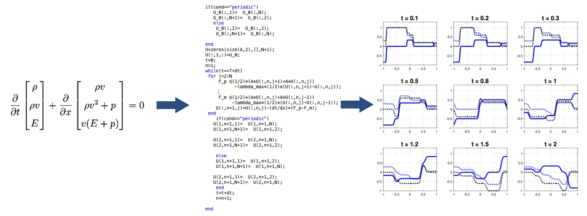

Hi, my name is Mattia and this is a space where I share some of the work I have done during my studies in applied mathematics. I have always explored from the beginning of my studies the topic of artificial neural networks and from these then I studied the foundations of many algorithms underlying machine learning.

###

  
  
  
  
  
  
  
  
  
  
  
  
  
  
  

###

What has always fascinated me is the very strong connection between the theoretical model and its software implementation-it is as if a code can adapt a theory to reality. I tried various programming languages and in each of them the moment a mathematical model produced a figure it always made me very excited, it was as if I had brought theory and reality together.

###

My Linkedin contact here

###

  

###
